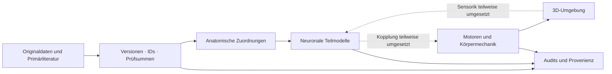

<div align="center">

# FLIEGE

### From connectome to embodied behaviour

**Offene, KI-gestützte Forschung an einer verkörperten künstlichen Fruchtfliege.**

[](#forschungsstand)
[](LICENSE)
[](LICENSES.md)

**Forschung und Entwicklung mit GPT-6 SOL und GPT-6 ASTRA**  
Ein Projekt von **IT-EXPRESS Bayern** · Forschungsstand: **27. September 2026**

[Schnellstart](#schnellstart) · [Ergebnisse](#forschungsstand) · [Daten & Quellen](#daten--quellen) · [Mitwirken](CONTRIBUTING.md) · [English](#english-summary)

</div>

---

> **Die vollständige Rekonstruktion ist in Arbeit.** Dieses Repository enthält anatomische Auswertungen, experimentelle neuronale Modelle und einen 3D-Körper. Die Module bilden noch kein vollständig verbundenes, biologisch validiertes Tier. Freier Flug, selbstständige Lebensführung und Bewusstsein sind nicht nachgewiesen.

## Warum dieses Projekt?

Ein Konnektom beschreibt Verbindungen zwischen Nervenzellen. Um daraus Verhalten zu erzeugen, braucht es zusätzlich Zelldynamik, Sinnesreize, Muskeln, Körpermechanik und Rückkopplung aus der Umgebung. FLIEGE untersucht diese Übergänge anhand veröffentlichter Daten und nachvollziehbarer Tests.

Wir veröffentlichen Code, Quellen, Identitätszuordnungen, Methoden und Gegenbefunde, damit andere auf diesem Stand aufbauen können. Ungeklärte Verbindungen und Parameter bleiben als Hypothesen erkennbar. Das langfristige Ziel ist eine Fliege mit Eigenaktivität, deren Verhalten aus ihren Schaltungen und ihrer Umwelt entsteht.

### Was du hier findest

- **Konnektom-Audits:** Neuronen, Synapsen, Detektorunterschiede und priorisierte Prüfkandidaten.
- **Exakte Zellidentitäten:** Zuordnungen zu Sensorik und Körperzielen mit nachvollziehbaren Quellen und Versionen.
- **Kontrollierte Modelle:** Gelenksteuerung, ein lokaler Sensor-Motor-Kreis und eine CPG-Nachrechnung mit Originalparametern.
- **Interaktive 3D-Labore:** Körper, Zellkatalog, Gelenke, Neuronenskelette und ein Flügel-Rollprüfstand.
- **Wiederverwendbare Forschung:** Quellenregistraturen, Prüfsummen, Auswerteskripte und offene Fragen.

## Schnellstart

Die Browserlabore benötigen **Node.js**; der lokale Entwicklungsstand nutzt **24.19.0**. Three.js liegt mit seiner MIT-Lizenz bei. Für die mitgelieferten Ansichten ist kein npm-Installationsschritt nötig.

```bash
git clone https://github.com/IT-EXPRESS-Bayern/Fliege.git
cd Fliege
node app/server.mjs
```

Öffne **http://127.0.0.1:4173/** im Browser. Der Server lauscht nur auf dem eigenen Rechner.

| Ansicht | Adresse nach dem Start | Inhalt und Grenze |
| :-- | :-- | :-- |
| 3D-Arena | `/` | Abstrakter Controller mit Eigenaktivität; noch kein FlyWire-gesteuertes Tier |
| Neuronenlabor | `/lab.html` | Zellkatalog, gespeicherte Modellversuche, hypothetischer Körperadapter |
| Motorlabor | `/motor.html` | Direkte Beuger-/Strecker-Interventionen an sechs Beinen |
| Sensor-Motor-Kreis | `/sensorimotor.html` | Rückkopplung eines Vorderbeingelenks über einen ausgewählten BANC-Ausschnitt |
| CPG-Betrachter | `/cpg.html` | Gespeicherte Ergebnisse der acht CPG-Kontrollbedingungen |
| Flügellabor | `/flight.html` | Mechanischer Rollprüfstand; neue Oberfläche, visuelle Prüfung noch offen |
| Gehirn-Ankerpunkte | `/brain.html` | Neuronenpositionen, keine vollständige Hirnoberfläche |
| R7-Skelett | `/skeleton.html` | Ausgewählte originale Äste und Synapsenpunkte |

**Berechnungsort:** Die interaktiven Sensor-Motor- und Flugmodelle rechnen derzeit in Browser-Workern auf dem Rechner des Betrachters. Die Verlagerung umfangreicher Forschungsrechnungen in die Cloud ist ein gesonderter Arbeitsschritt; GitHub ist kein Simulationsbackend.

**Datenumfang:** Browserauszüge und gespeicherte Ergebnisse liegen bei. Große Originaltabellen, vollständige Skelette und Ganzhirn-Binärgraphen müssen separat bezogen werden. Ohne diese Dateien ist die Ganzhirn-Laufzeit nicht verfügbar; die Arena bleibt als Demonstrator gekennzeichnet. Der ursprüngliche interaktive Data-Bericht benötigt eine gesonderte Laufzeit und ist nicht Teil dieses Exports. Seine wissenschaftlichen Ergebnisse stehen als Markdown-Berichte und Audits zur Verfügung.

## Forschungsstand

Die Zahlen stammen aus gespeicherten Projekt-Audits. Sie sind keine unabhängige biologische Validierung und gelten nur innerhalb der dokumentierten Untersuchung.

| Bereich | Dokumentierter Befund | Offene Grenze |
| :-- | :-- | :-- |
| **FAFB-Graph** | 139.255 offizielle IDs; 15.091.983 gerichtete Paare; 54.492.922 Kontakte im aggregierten Proofread-Graphen | Zusätzliche Detektoraufrufe einzeln beurteilen; Originalgraph unverändert |
| **Neuronenkatalog** | 138.765 IDs mit Name, Typ oder Alias; 22.312 mit kuratierter Funktionsannotation | Benennbarkeit, Literaturfunktion und Modellantwort unterscheiden |
| **Sensor-Motor-Kreis** | 54 Sensoren, 19 Motorneuronen; 194 Kontrollen und 24 Transferproben | Auslenkungsreduktion bei Gain 4: −0,59869 bis +0,33022 %; passive Mechanik dominiert |
| **CPG-Nachrechnung** | 4.963 Zellen; Originalparametersatz 0; sechs Motorzellen unter tonischem DNg100-Eingang rhythmisch (~15,15 Hz) | Acht Bedingungen, ein Parametersatz; Solverportierung, kein Vergleich mit archivierten Originaltrajektorien |
| **Flügelanatomie** | 62 echte Flügelmotorzeilen: 24 Leistung, 24 Steuerung, 12 Spannung, 2 ungeklärt | Individuelle Wirkungen, Sensor-Tuning und Kraftkennlinien unvollständig |
| **Flügelmechanik** | 26 Kontrollen; tonischer Antrieb erhält eine mechanische Schwingung | Direkte Motorbefehle, abstrakte Rollsensorik, unkalibrierte Kräfte; keine zentrale Flugnetz-Dynamik und kein Abheben |

### Gegenbefunde sind Teil des Ergebnisses

- Der JO-C/E-versus-JO-F-Vergleich wurde im bisherigen Ganzhirnmodell **nicht reproduziert**.
- Der lokale Gelenkregelkreis belegt bislang **keine biologische Stabilisierung**.
- E1-/E2-Entfernung beseitigt die Rhythmik der geprüften CPG-Konfiguration; I2-Entfernung tut dies nicht. Das ist eine **Modellbeobachtung**, kein Experiment am lebenden Tier.
- Die invertierte, biologisch ungesicherte Steuerpolarität verschlechtert den Flügel-Rollversuch. Die günstige Variante gilt deshalb nicht als gefundenes biologisches Vorzeichen.

**Methoden und Belege:** [Graphanalyse](analysis/report.md) · [Detektorvergleich](analysis/whole_brain_detector_comparison/METHODEN_UND_ERGEBNISSE.md) · [Funktionsversuche](analysis/neuron_assays/README.md) · [Sensor-Motor-Modell](app/SENSORIMOTOR_METHODS.md) · [CPG-Ergebnisse](analysis/cpg_reproduction/results.md) · [Flügelmodell](app/FLIGHT_METHODS.md)

## Architektur und Evidenz



Wir unterscheiden **gemessene Anatomie, Literaturbefunde, Modellannahmen und Simulationsergebnisse**. Strukturelle Erreichbarkeit allein beweist keine Funktion.

- **FAFB/FlyWire, BANC und MaleCNS sind verschiedene Präparate.** Ihre IDs werden nicht direkt verbunden.
- **Root-IDs bleiben Dezimalstrings.** Viele überschreiten JavaScripts exakt darstellbaren Ganzzahlbereich.
- **Detektorversionen bleiben getrennt.** Alternative Exporte werden nicht als zusätzliche Kontaktmengen aufaddiert.
- **Originaldaten bleiben erhalten.** Ergänzungen, Typ-Hypothesen und Konflikte werden separat geführt.

## Daten & Quellen

Die wissenschaftliche Grundlage stammt von den jeweiligen Forschungsteams. Dieses Projekt beansprucht weder die Erhebung der Originaldaten noch deren Erstveröffentlichung.

| Quelle | Verwendung | Originalzugang |
| :-- | :-- | :-- |
| FlyWire / FAFB v783 | Neuronen, Synapsen, aggregierte Konnektivität | [Zenodo 10676866](https://doi.org/10.5281/zenodo.10676866) |
| Schlegel et al. / Morphologie | Skelette und NBLAST | [Zenodo 10877326](https://doi.org/10.5281/zenodo.10877326) |
| FlyWire annotations v2.1.0 | Typen, Namen, Positionen, Transmitterfelder | [Gepinnte Veröffentlichung](https://github.com/flyconnectome/flywire_annotations/releases/tag/v2.1.0) |
| Princeton-Detektor / Codex | Detektorvergleich im selben FAFB-Präparat | [Codex](https://codex.flywire.ai/) · [Yu et al.](https://doi.org/10.1101/2025.07.11.664377) |
| BANC v888 | Gehirn und Bauchmark; Sensorik und Motorwege | [Harvard Dataverse](https://doi.org/10.7910/DVN/7WTH1N) |
| MaleCNS v1.0 | Vergleichende Zell- und Verbindungsevidenz | [Analyse mit Originalquellen](analysis/malecns_2026.md) |
| Shiu et al. und Eon | Ganzhirn-Modelle, Tabellen und Implementierungsvergleiche | [Quellenregistratur](docs/publication/SOURCES.md) |
| Pugliese et al. | CPG-Gleichung, Matrix, Laufkonfiguration und Parameter | [Originalcode](https://github.com/smpuglie/Pugliese_2026/tree/10e7661bf414ba7b4c2edf795cd36d0f878c17c0) · [Zenodo 22260924](https://doi.org/10.5281/zenodo.22260924) |
| FlyBody, FlyGym und weitere Verhaltensliteratur | Mechanik, Sensorik und Vergleichsmodelle | [Quellenregistratur](docs/publication/SOURCES.md) |

**Alle erfassten Quellen:** [Quellenverzeichnis](docs/publication/SOURCES.md) und [maschinenlesbarer Integrationsstand](analysis/model_integration_pack.json). Letzterer erfasst **160 Inputs und 46 definierte Joins**. Registrierung bedeutet noch keine dynamische Modellanbindung. Provenienzdateien dokumentieren Versionen, Original-URLs und vorhandene Prüfsummen.

Mikroskopbilder sind nicht Teil des Exports. Große Originaldaten werden von den offiziellen Quellen bezogen. Spezifische Zenodo-Lizenzen und abweichende FlyWire-Plattformbedingungen sind quellgenau dokumentiert; **keine pauschale kommerzielle Freigabe sämtlicher Daten**.

## Reproduzierbarkeit

```bash
# JavaScript-Kontrollen; manche Tests benötigen separate Forschungsdaten.
node --test app/tests/*.test.mjs
```

Für Python-Auswertungen: [Abhängigkeiten](analysis/requirements.txt), [neuronale Laufzeit](brain/README.md) und [CPG-Anleitung](analysis/cpg_reproduction/README.md). Zuerst die beschriebenen Eingaben und Prüfsummen prüfen. Browser-Replays stellen abgeschlossene Berechnungen dar; sie ersetzen keine neue neuronale Simulation. Die visuelle Browserprüfung der neuen Flügel- und CPG-Oberflächen ist noch offen; numerische Prüfungen sind separat dokumentiert.

| Verzeichnis | Inhalt |
| :-- | :-- |
| `app/` | Browseransichten, Körper- und Teilmodelle, Tests, kompakte Daten |
| `brain/` | Graphaufbereitung und neuronale Laufzeit |
| `analysis/` | Auswertungen, Audits, Methoden und Reproduktionsskripte |
| `docs/` | Forschungsstand, Quellen, Lizenzzuordnung und KI-Transparenz |
| `data/` | Separat bezogene Originaldaten; große Rohbestände bleiben außerhalb von Git |

## Roadmap

- [x] Originaldaten versionieren, Zellidentitäten prüfen und Quellen dokumentieren.
- [x] Sensor-/Motorpfade und lokale Körpermodelle aufbereiten.
- [x] CPG-Gleichungen mit gespeicherten Originalparametern kontrolliert nachrechnen.
- [x] Erste Flügelmechanik mit offengelegten Annahmen und Gegenproben implementieren.
- [ ] Neue Browseroberflächen vollständig visuell und interaktiv prüfen.
- [ ] Sensor-Tuning, Rezeptorwirkungen und Muskelparameter belastbar eingrenzen.
- [ ] Anatomisch belegte Flugschaltungen dynamisch mit dem Körper koppeln.
- [ ] Kräfte, Bodenkontakte und freien Flug kalibrieren und validieren.
- [ ] Robustheit über Parameter, Präparate und unabhängige Verhaltenstests prüfen.
- [ ] Integriertes Gehirn–Körper–Umwelt-System mit dokumentierter Eigenaktivität erreichen.

## GPT-6 SOL & GPT-6 ASTRA

**GPT-6 SOL und GPT-6 ASTRA treiben Recherche, Datenaufbereitung, Implementierung und Prüfung dieses Projekts als eingesetzte KI-Modelle voran.** IT-EXPRESS Bayern betreibt das Projekt und legt dessen Richtung fest. KI-generierte Auswertungen können Fehler enthalten; deshalb veröffentlichen wir Quellen, Methoden, Tests und Unsicherheiten.

Die Nennung ist keine wissenschaftliche Begutachtung, Bestätigung durch OpenAI oder Beteiligung der ursprünglichen Datenersteller. Ohne Laufprotokoll wird kein einzelnes Ergebnis nachträglich einem bestimmten Modell zugeschrieben. Details: [KI-Transparenz](docs/AI_RESEARCH.md).

## Lizenz und Zitation

- **Eigener Programmcode:** [MIT](LICENSE), für unkomplizierte Weiterentwicklung und Wiederverwendung.
- **Eigene Berichte und Dokumentation:** [CC BY 4.0](docs/LICENSE-CC-BY-4.0.txt), mit Namensnennung und Kennzeichnung von Änderungen.
- **Fremdcode, Originaldaten und abgeleitete Auszüge:** jeweilige Ursprungslizenz; keine Umlizenzierung durch die Projektlizenz. Siehe [Lizenzzuordnung](LICENSES.md).

Bitte **dieses Repository mit Commit-ID** und die **jeweiligen Originalarbeiten und Datensätze** zitieren. [CITATION.cff](CITATION.cff) enthält die Projektmetadaten. Eine Projektnennung ersetzt die Quellenzitation nicht.

## Mitwirken

Reproduktionen, korrigierte Zellidentitäten, bessere Parameterbelege und unabhängige Tests sind willkommen. Bitte Quelle, Datensatzversion, betroffene IDs und reproduzierbare Schritte angeben. Auch fehlgeschlagene Versuche helfen. Einstieg: [CONTRIBUTING.md](CONTRIBUTING.md).

## English summary

**FLIEGE is an ongoing, AI-assisted research project toward an embodied fruit-fly model, developed with GPT-6 SOL and GPT-6 ASTRA.** It combines published connectomes, traceable cell identities, controlled neural submodels and browser-based body experiments. The full reconstruction is incomplete. Current results do not establish free flight, whole-animal autonomy or consciousness. Anatomy, literature evidence, modeling assumptions and simulation outputs remain distinct. Original code is MIT-licensed; project reports use CC BY 4.0; third-party material retains its original terms.
